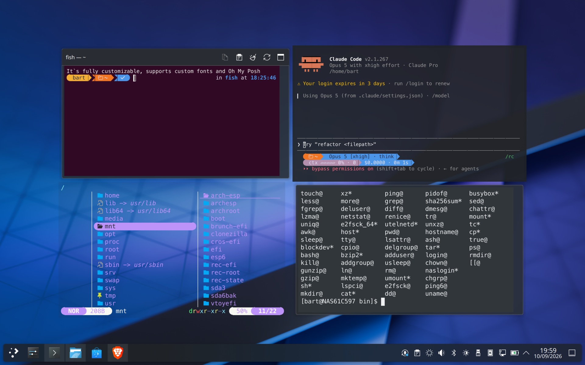
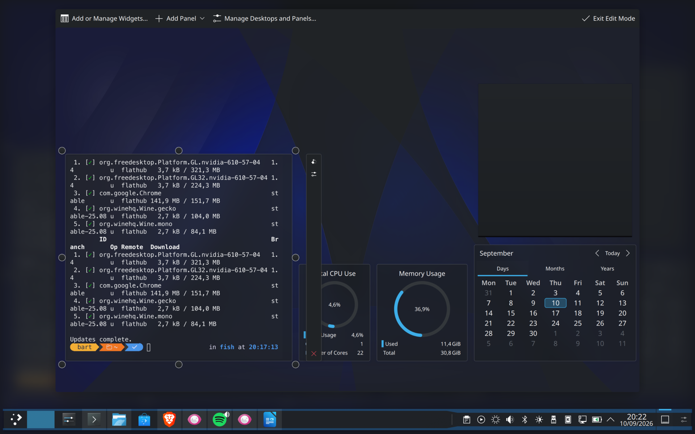
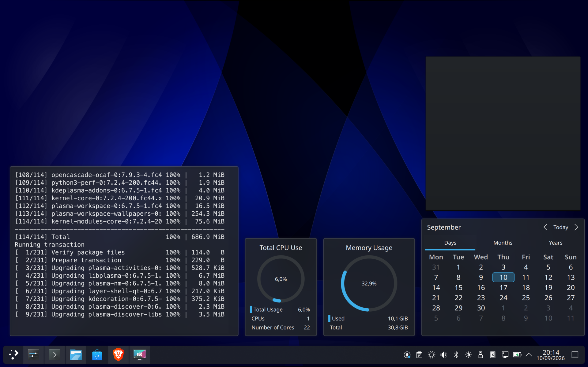
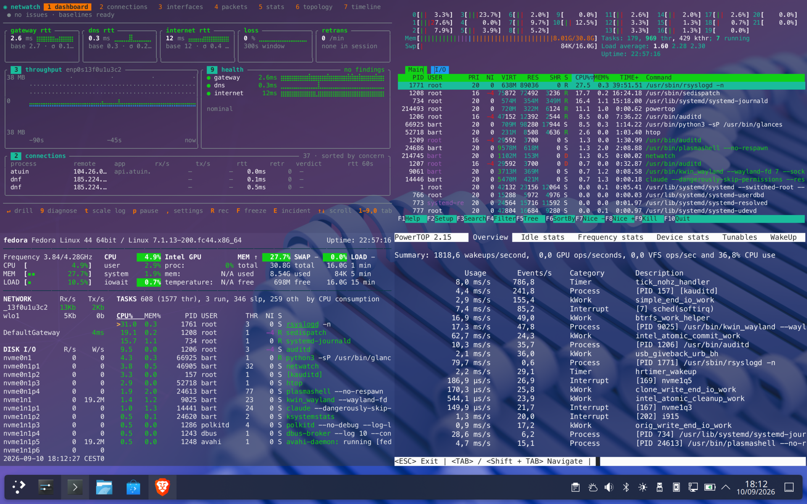
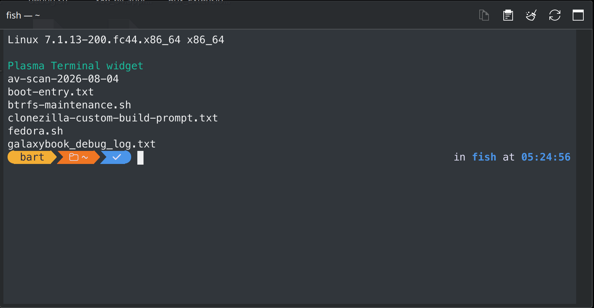

# Plasma Terminal Widget

A terminal emulator that lives on the KDE Plasma 6 desktop as an ordinary
widget. Drag it, resize it, put it behind your icons, give it the colours and
font you already use — it behaves like the rest of your desktop, because it is
drawn by the shell itself.



## Build and install

```bash
git clone https://github.com/Cir0cuit/plasma-terminal-widget.git
cd plasma-terminal-widget
./install.sh
```

`install.sh` configures and builds the project, then installs both halves: the
QML module with `sudo cmake --install` (it has to land on Qt's import path) and
the applet with `kpackagetool6` for the current user only. It will ask for your
password for the first of those.

Build dependencies on Fedora 44:

```bash
sudo dnf install cmake gcc-c++ qt6-qtbase-devel qt6-qtdeclarative-devel \
    qt6-qt5compat-devel kf6-kcoreaddons-devel kf6-kpty-devel
```

Restart plasmashell afterwards so it picks up the new QML module:

```bash
systemctl --user restart plasma-plasmashell.service
```

Then add it from the desktop context menu: *Add Widgets… → Terminal*. To remove
everything again, run `./uninstall.sh` — take the widgets off the desktop
first, or the shell will show an empty placeholder until it is restarted.

## How it works

The terminal view is a `QQuickPaintedItem`, so it is a first-class item in
plasmashell's own scene graph. That has a few practical consequences:

* it moves, resizes and clips with the applet, and stacks correctly against
  other widgets;
* it paints at the screen's device pixel ratio, so text stays crisp on HiDPI
  displays;
* it uses the ordinary Qt clipboard and the ordinary Qt input path, so
  selection, copy, paste and keyboard handling work the way they do in any
  other Qt application.

There is no helper process, no embedded window and no second compositor: the
widget owns a pty directly and paints the characters itself.

|  |  |
| :-- | :-- |
| Plasma's edit mode treats it like any other widget: resize handles, the widget toolbar, and its own configuration dialog. | It sits on the desktop next to the stock system-monitor and calendar widgets, under the same wallpaper and the same stacking rules. |

## Architecture

```
package/                 the plasmoid (QML)  ->  ~/.local/share/plasma/plasmoids/
  contents/ui/main.qml         PlasmoidItem, desktop + panel representations
  contents/ui/TerminalPane.qml header, terminal, scrollbar, context menu
  contents/ui/Config*.qml      the three settings pages
src/                     the QML module (C++) ->  /usr/lib64/qt6/qml/io/github/cir0cuit/plasmaterminal/core/
  terminalview.*               QQuickItem: input, focus, clipboard, zoom, drops
  terminalsessionex.*          the shell session: env, scrollback, resets
  terminalinfo.*               fonts, colour schemes, Konsole profile lookup
  color-schemes/               8 extra schemes on top of the 13 built in
lib/                     terminal core, vendored (GPL-2.0-or-later)
test/                    a standalone host for the terminal item, plus helpers
```

The QML module has to live on Qt's own import path because that is where
plasmashell resolves imports from; the applet package is per-user. That split
is also why the widget cannot be installed from *Get New Widgets* alone: that
route unpacks a QML archive into your home directory, and nothing it writes is
on plasmashell's import path. If the module is missing, the widget says so and
points here rather than failing with an error box.

### Vendored code and local modifications

`lib/` is the terminal core from KDE's
[qmlkonsole](https://invent.kde.org/utilities/qmlkonsole) 26.08.0 — a Qt6 QML
terminal built on QMLTermWidget and, underneath that, Konsole's VT102
emulation. All the hard work of terminal emulation is theirs; this project
provides the Plasma widget around it.

As required by the GPL, the changes made to that vendored code are listed here
and marked `(patched)` at each site:

1. `TerminalSession.cpp` — `TERM` is passed to the child through the session
   environment instead of being set on the hosting process.
2. `Session.cpp` — the `COLORFGBG` hint is appended to a copy of the
   environment at launch, so repeated starts do not accumulate copies of it.
3. `TerminalSession.h` — added a `konsoleSession()` accessor, so scrollback and
   emulation resets can be driven from QML.
4. `BlockArray.cpp` — the four block offsets passed to `fseek()` are computed
   as `long` rather than multiplied as `int` and widened afterwards, which
   overflows above a 2 GiB history file. Found by CodeQL; the code is an
   unused history backend, so nothing in the widget can reach it.

## Settings

**Appearance** — follow your Konsole profile font or pick a family and size,
line spacing, colour scheme (21 ship with the widget, and any schemes Konsole
already has installed are listed too) with a live preview swatch, widget
background (Plasma frame / translucent / none), terminal opacity, padding,
cursor shape, blinking cursor, full-height cursor, bold-as-intense, glyph
antialiasing, title-and-toolbar strip, scrollbar and scrollbar auto-hide.

**Shell** — program and arguments, working directory, a command to run at
startup, start-on-load, scrollback lines or unlimited, flow control, and extra
environment variables.

**Behavior** — focus on click, copy on select, middle-click paste, Ctrl+wheel
zoom, word characters for double-click selection, built-in clipboard
shortcuts, read-only mode, terminal bell, and what to do when the shell exits
(new session / restart button / leave the last screen).

Leaving the font and colour scheme unset means *follow my default Konsole
profile*, so the widget matches the terminal you already use.



## Keys and mouse

| Input | Action |
| --- | --- |
| Ctrl+Shift+C / Ctrl+Shift+V | copy / paste |
| Ctrl+Shift+`+` / `-` / `0` | zoom in / out / reset |
| Ctrl+wheel | zoom |
| wheel | scroll the scrollback |
| double click | select a word |
| right click | context menu |
| middle click | paste the selection (off by default) |
| drag files onto it | insert their paths, quoted where the shell needs it |

The keyboard shortcuts and Ctrl+wheel zoom are the widget's own, and each can
be turned off under **Behavior** if the program in the terminal wants those
keys instead. Everything else goes straight to the shell.

The optional strip along the top shows the session title and buttons for copy,
paste, clear-and-reset, restart and *Open in Konsole*, which hands the current
working directory to a real Konsole window. The same entries — plus
*Configure Terminal…* — are on the right-click menu, and they appear again in
Plasma's own widget menu.



## Notes

* Colour schemes are listed and previewed by name; the description field in
  scheme files is not shown.
* The context menu is drawn inside the shell's window rather than as a separate
  popup window, which is how QtQuick Controls popups behave inside a plasmoid.
* Tabs and search-in-scrollback are not implemented.

## Testing

`test/harness.qml` runs the terminal item on its own, outside plasmashell:

```bash
./build/pt-harness -I build/qml test/harness.qml
```

It starts a shell, types through the real key path, resizes the view and
reports what it observed. Qt on Fedora sends messages to the journal when
stderr is not a tty, so read them with `journalctl --user -t pt-harness`.

`test/pointer.sh` moves the pointer to an exact position under KWin, which the
interactive tests need because ydotool emits accelerated relative motion.

## How this was built

This widget was written with an AI coding agent — Claude Code — doing the
implementation, under human direction and review. The vendored terminal core is
upstream KDE code; the C++ QML module, the plasmoid and the settings pages are
agent-written.

That is a statement of fact rather than an excuse, but it comes with a limit
worth stating plainly. The project is new and has run on one configuration:
Fedora 44, Plasma 6.7 on Wayland, a single HiDPI screen at scale 2. What was
checked there was checked properly — sessions start and stop, input and
clipboard go through the real event path, teardown leaves no stray shell
processes, and the widget survives being moved, resized and reconfigured on a
live desktop. What has not been tried is everything else: X11, other
distributions and Qt builds, fractional or 1× scaling, multiple monitors, and
most of the settings in combination with one another. If it misbehaves, the
useful bug report is the one that says what your setup was.

## Contributing

Contributions are welcome. Anything that meets a high quality bar will be
considered and, most likely, merged — a clear description of the problem, a
change that does one thing, and evidence that you ran it.

AI-assisted contributions are equally welcome, on one condition: a human has to
have verified them. Either you understand what the agent produced well enough
to defend it line by line, or you have tested it thoroughly enough to know it
works. Both is better.

What will not be accepted is unverified output submitted on the assumption that
someone else will check it: patches that break existing behaviour, that make
the widget unusable, or that fix bugs which do not exist. Reviewing that costs
more than writing it did, and repeatedly submitting it is grounds for a ban.

If you are unsure whether an idea fits, open an issue before writing the code.

## Credits

The terminal emulation comes from Konsole by way of QMLTermWidget and
qmlkonsole — thanks to Lars Doelle, Robert Knight, Dmitry Zagnoyko, Jonah
Brüchert and everyone else who has worked on them.

## Licence

GPL-2.0-or-later, following the vendored terminal core. See `LICENSE`.
